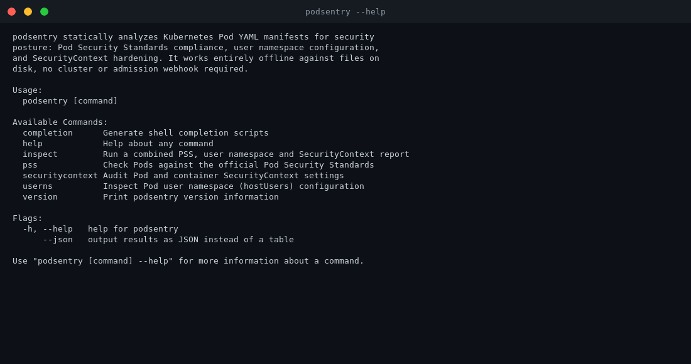
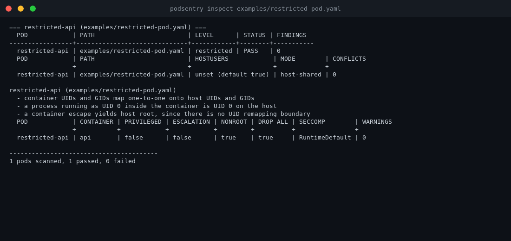
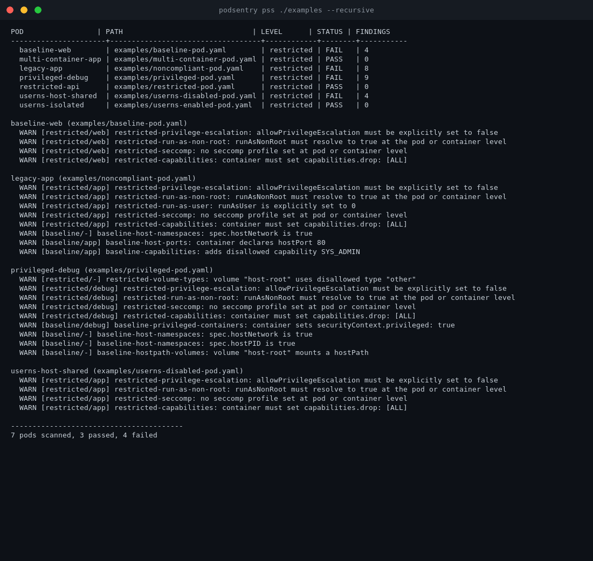
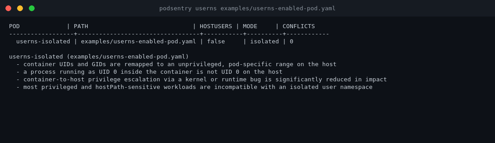
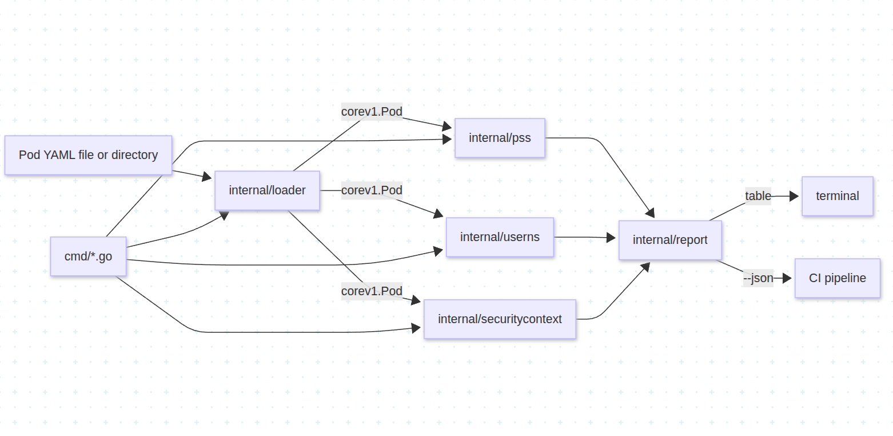

# 🛡️ podsentry

**Static security auditing for Kubernetes Pod specs — no cluster required.**
Point it at a YAML file or a whole manifest repo and get a Pod Security Standards, user namespace, and SecurityContext report back in seconds.

[](https://go.dev)
[](LICENSE)
[](https://kubernetes.io/docs/concepts/security/pod-security-standards/)
[](https://github.com/spf13/cobra)



<table>
  <tr>
    <td></td>
    <td></td>
  </tr>
  <tr>
    <td align="center"><code>podsentry inspect</code></td>
    <td align="center"><code>podsentry pss ./examples --recursive</code></td>
  </tr>
  <tr>
    <td></td>
    <td align="center" valign="middle">Works entirely offline against files on disk.<br>No cluster, no admission webhook, no live API server.</td>
  </tr>
  <tr>
    <td align="center"><code>podsentry userns</code></td>
    <td></td>
  </tr>
</table>

## Features

- Checks Pods against all three official Pod Security Standard levels (Privileged, Baseline, Restricted), with rule logic matching the upstream Kubernetes definitions
- Inspects `hostUsers` and explains the resulting UID/GID mapping and container-escape blast radius
- Audits added/dropped Linux capabilities against the safe baseline set
- Checks privilege escalation, `runAsNonRoot`, `runAsUser`, `runAsGroup`
- Checks seccomp profile type at the pod and container level
- Checks host namespace usage — `hostNetwork`, `hostPID`, `hostIPC`, host ports
- Combined `inspect` report merging PSS, user namespace, and SecurityContext findings
- JSON output for CI pipelines, colored table output for humans
- Recursive directory scanning to audit entire manifest repositories
- `--exit-code` support for CI gating
- Reads a single file or a directory of YAML files
- 100% offline — no cluster, no admission webhook, no external services

## Commands

| Command | Description |
|---|---|
| `podsentry pss pod.yaml` | Check a Pod against the Pod Security Standards (defaults to `restricted`) |
| `podsentry pss pod.yaml --level restricted` | Check against a specific level: `privileged`, `baseline`, or `restricted` |
| `podsentry pss ./manifests/ --recursive --exit-code` | CI-friendly recursive directory scan with a non-zero exit on failure |
| `podsentry userns pod.yaml` | Inspect `hostUsers` configuration and UID mapping implications |
| `podsentry securitycontext pod.yaml` | Audit capabilities, privilege escalation, seccomp, and host namespaces |
| `podsentry inspect pod.yaml` | Full combined PSS + userns + SecurityContext report |
| `podsentry version` | Show version info |
| `podsentry completion [shell]` | Generate shell completion scripts |

Every command accepts `--json` for machine-readable output instead of a table.

## What are Pod Security Standards?

The [Pod Security Standards](https://kubernetes.io/docs/concepts/security/pod-security-standards/) are Kubernetes' own definition of three security profiles a Pod can be checked against:

- **Privileged** — unrestricted, for trusted system/infra workloads.
- **Baseline** — blocks known privilege escalations (privileged containers, host namespaces, hostPath volumes, disallowed capabilities) while staying broadly compatible with common workloads.
- **Restricted** — the hardened profile: on top of Baseline, it requires running as a non-root user, dropping all capabilities, disallowing privilege escalation, and enforcing a seccomp profile.

Clusters normally enforce these at admission time via the built-in Pod Security Admission controller. podsentry lets you check the same rules **before** a manifest ever reaches a cluster — in a pre-commit hook, in CI, or just on your laptop.

## What are User Namespaces?

Kubernetes can run a Pod in its own **user namespace** (`hostUsers: false`), remapping container UIDs/GIDs to an unprivileged, pod-specific range on the host. A process that looks like root (UID 0) *inside* the container is an ordinary unprivileged user *outside* of it, which significantly limits the blast radius of a container-to-host escape.

`podsentry userns` reads the `hostUsers` field, tells you which mode a Pod is running in, explains the mapping implications in plain language, and flags configurations that conflict with an isolated user namespace — privileged containers, host namespace sharing, and hostPath volumes are all incompatible with `hostUsers: false`.

## Tech stack

| Component | Purpose |
|---|---|
| [Go 1.22+](https://go.dev) | Language / runtime |
| [cobra](https://github.com/spf13/cobra) | CLI command framework |
| [k8s.io/api](https://pkg.go.dev/k8s.io/api) | Core Kubernetes types (Pod, PodSpec, SecurityContext) |
| [k8s.io/apimachinery](https://pkg.go.dev/k8s.io/apimachinery) | Object handling shared by the Kubernetes API types |
| [gopkg.in/yaml.v3](https://pkg.go.dev/gopkg.in/yaml.v3) | YAML parsing |
| [tablewriter](https://github.com/olekukonko/tablewriter) | Table rendering for human output |
| [fatih/color](https://github.com/fatih/color) | Colored terminal output |

No database. No external services. No cluster dependency.

## Architecture



`internal/loader` is the only package that touches the filesystem. Every check package (`pss`, `userns`, `securitycontext`) operates purely on an in-memory `corev1.PodSpec` and has no I/O of its own, which is what makes them straightforward to unit test.

## CI usage

```yaml
# .github/workflows/podsentry.yml
name: podsentry
on: [pull_request]
jobs:
  audit:
    runs-on: ubuntu-latest
    steps:
      - uses: actions/checkout@v4
      - uses: actions/setup-go@v5
        with:
          go-version: "1.22"
      - run: go install github.com/mdryaan/podsentry@latest
      - run: podsentry pss ./manifests --recursive --level restricted --exit-code
```

The `--exit-code` flag makes any command exit non-zero if a Pod fails a check, so it gates the job the same way a test failure would.

## Prerequisites

- Go 1.22 or newer (only needed to build from source; a prebuilt binary has no runtime dependency)

## Install and run locally

```bash
git clone https://github.com/mdryaan/podsentry.git
cd podsentry
go mod download
go build -o podsentry ./main.go
./podsentry --help
```

Or install directly with `go install`:

```bash
go install github.com/mdryaan/podsentry@latest
```

## Example usage

```bash
# Check a single pod against the restricted level (the default)
./podsentry pss examples/restricted-pod.yaml

# Check against a specific level
./podsentry pss examples/baseline-pod.yaml --level baseline

# Recursively scan a manifest repository and fail CI on any violation
./podsentry pss ./examples --recursive --exit-code

# Inspect user namespace configuration
./podsentry userns examples/userns-enabled-pod.yaml

# Audit SecurityContext settings
./podsentry securitycontext examples/noncompliant-pod.yaml

# Full combined report
./podsentry inspect examples/restricted-pod.yaml

# JSON output for scripting
./podsentry inspect examples/restricted-pod.yaml --json
```

## Contributing

Contributions are welcome. See [CONTRIBUTING.md](CONTRIBUTING.md) for dev environment setup, how to add a new PSS rule or report formatter, and PR guidelines.

## Roadmap

- [ ] Kustomize and Helm chart rendering support (audit templates, not just static Pods)
- [ ] Namespace-scoped PodSecurity label validation (compare a namespace's enforce/warn/audit labels against actual Pods)
- [ ] SARIF output for GitHub code scanning integration
- [ ] Config file support for custom capability allowlists and rule suppression
- [ ] `--diff` mode to show only what changed between two scans

## License

MIT — see [LICENSE](LICENSE).
